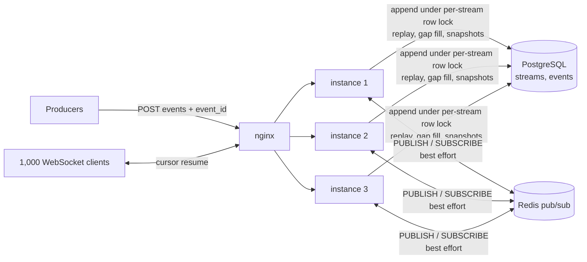

# livefeed: real-time event streaming

[](https://github.com/AnuragBhandary/Real-Time-Event-Streaming/actions/workflows/ci.yml)


A live event feed, demoed as a real-time cricket scoreboard. Producers publish events,
PostgreSQL stores them in order, and every WebSocket subscriber on any instance receives each
event **exactly once, in order**. That holds through reconnects, instance crashes, Redis failures
and slow clients.

**Stack:** Python 3.12, asyncio, FastAPI + WebSockets, PostgreSQL (ordered log and snapshots),
Redis pub/sub (cross-instance fan-out), nginx, Docker, GitHub Actions.

### Measured results ([details](docs/BENCHMARKS.md))

| 1,000 WebSocket clients · 3 instances · 100,000 events · continuous chaos | |
|---|---|
| Deliveries | **5,000,000 / 5,000,000**; every client ended with every event |
| Duplicate or out-of-order events | **0** (measured at the protocol level) |
| Reconnects survived | **14,069**: random client drops, 5 instance SIGKILLs, 8 Redis pub/sub kills |
| Live delivery latency | **p95 5 ms**, p99 14.5 ms (producer send → subscriber receive) |
| Headroom (no chaos) | ≈ 50,000 deliveries/s at p95 71 ms |

## How it works



- **Ordering.** Appends lock the stream's row, so `seq = last_seq + 1` is assigned in commit
  order. If seq N is visible, everything before it is too.
- **Fan-out.** After commit the event is published to Redis. Each instance forwards it to its
  local clients. The event is serialised once and the same bytes go to every client.
- **Pub/sub is allowed to fail.** Each instance tracks the last seq it delivered per stream. It
  drops duplicates and fills gaps from PostgreSQL. A 1-second resync loop catches lost final
  messages. Out-of-order delivery across instances is repaired the same way.
- **Race-free resume.** A reconnecting client is registered *before* its history replay, and
  live events are buffered meanwhile. Replay is paged, flow-controlled and **bounded**: a cursor
  more than 10,000 behind gets a snapshot instead.
- **Backpressure.** Each client has a bounded queue and its own writer task. A client that falls
  behind is closed with `4008` and resumes from its cursor. Memory stays bounded and other clients
  are never slowed. Producers get `429` (token bucket) or `503` (load shedding).
- **One recovery path.** Network drops, crashes, deploys (`1012`), slow consumers (`4008`) and
  detected gaps (`4009`) all end the same way: reconnect and resume from the cursor.

Full reasoning, alternatives and failure analysis: **[docs/DESIGN.md](docs/DESIGN.md)**.

## Quick start

```bash
docker compose up -d --build --wait     # PostgreSQL, Redis, 3 instances, nginx on :8080
make demo                               # simulated live matches
```

Open http://localhost:8080 and enter a stream id from `curl localhost:8080/v1/streams/<id>` or
the simulator's output to watch the scoreboard update live. API docs are at http://localhost:8080/docs.

### Python SDK

```python
from livefeed.client import Producer, Subscription

async with Producer("http://localhost:8080", api_key) as producer:
    await producer.create_stream("final-2026", kind="match")
    await producer.publish("final-2026", "match_started", {"teams": ["MI", "CSK"]})
    await producer.publish("final-2026", "score", {"team": "MI", "points": 6})  # retries are idempotent

async with Subscription(["ws://localhost:8080"], "final-2026") as sub:
    async for item in sub:        # Snapshot first, then Events with consecutive seq numbers
        print(item)               # survives disconnects: resumes from its cursor automatically
```

### API

| | | |
|---|---|---|
| `POST` | `/v1/streams` | Create a stream (`generic` or `match`) |
| `POST` | `/v1/streams/{id}/events` | Append 1-500 events atomically; `event_id` makes retries idempotent |
| `GET` | `/v1/streams/{id}` | Snapshot: materialised state + the seq it reflects |
| `GET` | `/v1/streams/{id}/events?after=&limit=` | History / HTTP catch-up |
| `WS` | `/v1/streams/{id}/ws?cursor=` | Live subscription (snapshot or replay, then live) |
| `GET` | `/healthz`, `/readyz`, `/metrics`, `/v1/instance` | Ops |

WebSocket frames: `snapshot`, `events` (`replay: bool`, consecutive `items`), `heartbeat`
(`seq`, `head`), `pong`. Close codes: `4004` unknown stream, `4008` slow consumer, `4009` resync,
`1012` restart.

## Testing

```bash
make infra && make check    # ruff, mypy, 62 tests (93% coverage)
make load-smoke             # 1-minute load test with every kind of chaos
```

The tests use real PostgreSQL, Redis and uvicorn servers, including three instances in one test.
They cover:
- **Pub/sub repair:** lost, duplicated and reordered messages; killed pub/sub connections.
- **Clients:** joins racing a live publisher; a raw TCP client that never reads (cut off with
  `4008` while others are unaffected).
- **Chaos:** SIGKILL of real server processes mid-stream (`tests/test_chaos.py`).

## Layout

```
src/livefeed/
  repository.py   append (row lock, idempotency, reducer), replay, heads
  hub.py          Channel (dedupe, gap fill, resync), Session (queue, writer, 4008/4009), join
  bus.py          Redis pub/sub publish + resilient subscriber
  protocol.py     wire formats, close codes
  api/            FastAPI routes, auth, rate limiting, load shedding
  client.py       Subscription (cursor resume) and Producer (idempotent retries)
  reducers.py     snapshot state machines (generic, cricket match)
  simulator.py    live match generator
bench/loadtest.py 1,000-client load + chaos harness with protocol-level auditing
docs/             DESIGN.md · BENCHMARKS.md · INTERVIEW.md
```
